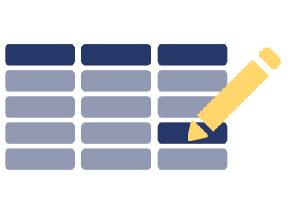

[](https://github.com/abris-platform/abris-components/actions/workflows/webpack.yml)
[](https://badge.fury.io/js/table4js)

<a href="https://github.com/abris-platform/abris-components/pulse" alt="Activity">
</a>
<a href="https://github.com/abris-platform/abris-components/issues">

</a>
<a href="https://github.com/abris-platform/abris-components/issues?utf8=%E2%9C%93&q=is%3Aissue+is%3Aclosed+">

</a>

# abris-components
This is a monorepository of JavaScript (TypeScript) components library. Right now it contains UI the only component: 
- table (grid) widget

The Table4JS widget is implemented for 3 web frameworks:
- PureJS (pure JavaScript package with no dependencies, with bundled Knockout engine inside) - [table4js package](https://www.npmjs.com/package/table4js)
- React - [table4react package](https://www.npmjs.com/package/table4react)
- Knockout - [table4ko package](https://www.npmjs.com/package/table4ko)

## Table4JS widget functionality



Table widget shows data in table (grid) form. It supports infinite scrolling, array datasets, sever-side data provider, filtering, sorting and columns summary. Widget allows to modify data via inplace editing, create and delete rows. 

## Getting started with Table4JS

### Pure JS - non-modular web application

Add the following scripts to HEAD part of your HTML file
```HTML
<script src="https://unpkg.com/table4js"></script>
<link href="https://unpkg.com/table4js/table4.css" rel="stylesheet">
```

Add the following markup to BODY part of your HTML file - where you want to see a table
```HTML
<div id="table-container" style="height: calc(100vh - 16px);"></div>
```

Add the following script to make it work
```JS
var options = {
    enableSearch: true,
    enableSummary: true,
    columns: [
        {
            name: "word",
            title: "Word"
        },
        {
            name: "num",
            title: "Number",
            type: "number"
        },
        {
            name: "text",
            title: "Text",
        }
    ],
};

var model = new Table4JS.Table(options);

var sampleData = [
    { word: "here ", num: 5, text: "O gentlemen, there is no need for you to confess your happiness, no one requires you to confess - who does not know your modesty!" },
    { word: "there ", num: 24, text: "Their bearing, although they were not completely calm, with its ease, full of dignity and humility at the same time, aroused admiration" },
    { word: "there ", num: 18, text: "I'm to blame, I'm to blame, because I choose my own people." }
];
model.data = sampleData;

model.render("#table-container");
```

Here is the table4js [live example with the above code](https://plnkr.co/edit/wBrB0EznDixVV1ra?open=lib%2Fscript.js&preview)

### React

Please check [table4react](https://www.npmjs.com/package/table4react) package readme file

### Knockout

Please check [table4ko](https://www.npmjs.com/package/table4ko) package readme file

### More info

For more advanced cases please check our [online demos](https://abris.site/examples) and [documentation](https://abris.site/docs)

## Project site and resources
Our official sie is [https://abris.site](https://abris.site)

### Online demos
[https://abris.site/examples](https://abris.site/examples)

The demos are framework-specific and you can choose your framework via selector Standalone/Knockout/React in the top left corner of the navigation panel. Each demo has html/js/css tab where you can get markup, css or JavaScript code to use in your application. Each demo also can be opened in a separate window.

### Documentation
Almost all code ralated to the Table4JS widget core functionality is cross-framework and used as a model for platform-specific rendering. You need to create widget model and set it properties or subscribe events to control table widget behavior. Table4JS model is described in our documentation:

[https://abris.site/docs](https://abris.site/docs)

## Roadmap for 2023
In our plans we have
- Demos and documentation improvements
- Row editing in a separate detail form
- Accessibility support
- Angular and Vue frameworks support
- Tree widget

## How to compile this repo
 - git clone https://github.com/abris-platform/abris-components.git
 - cd abris-components
 - npm i
 - npm test
 - npm run build

Build artifacts can be fount in the `/site/dist` subfolders: `standalone`, `react`, `knockout`
